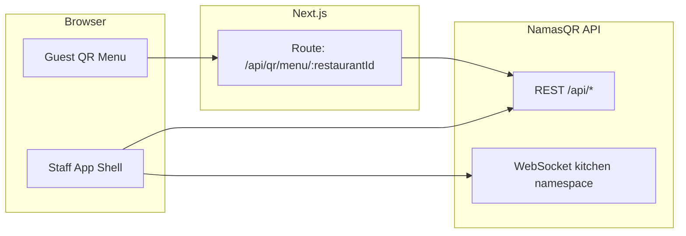

# Application state overview

This document describes the **current** shape of the qRyte (NamasQr) frontend: architecture, features, configuration, known gaps, and ideas for what to improve or add next. It reflects the codebase in this repository; the backend is the external **NamasQR API**.

---

## Executive summary

**qRyte** is a **multi-tenant restaurant operations and QR-ordering web app** for Indian hospitality (₹ / paise, `en-IN`). This repo is **almost entirely a frontend**: business rules, persistence, and most integrations live on a **remote NamasQR API** (`NEXT_PUBLIC_API_ORIGIN`). The app provides:

- **Staff**: dashboard, tables, floor map, menu management, orders, kitchen (KDS), waiters, inventory, analytics, settings—plus auth flows (onboarding, approval, super-admin).
- **Guests**: table-scoped QR menu and cart, placing orders via public/customer APIs (proxied menu fetch where needed).

Component layout conventions are documented separately in [COMPONENTS.md](./COMPONENTS.md).

---

## Architecture

### Stack

| Layer | Technology |
| --- | --- |
| Framework | Next.js 16 (App Router), React 19 |
| Server/client data | TanStack Query 5 (`lib/query-client.ts`, `lib/query-keys.ts`) |
| HTTP | `apiFetch` in `lib/api.ts`—Bearer access token, refresh-on-401 via `POST /api/auth/refresh` with cookies |
| Client state | Zustand (`store/`), persisted auth (`store/auth-store.ts`) |
| Realtime | `socket.io-client` (`lib/socket.ts`), kitchen invalidation (`lib/realtime.ts`) |
| Styling | Tailwind CSS, shadcn-style UI under `components/ui/` |

### Data flow (high level)

- **Staff** calls the API origin directly for authenticated routes (with JWT). Kitchen listens for `order:created` / `order:updated` and invalidates React Query caches.
- **Guest menu** uses `api.qrMenu(restaurantId)`, which requests the **Next.js** route `app/api/qr/menu/[restaurantId]/route.ts`. That handler tries `GET /api/public/menu` on NamasQR, then optionally proxies `GET /api/admin/menu` with `MENU_PROXY_BEARER_TOKEN` if the public route fails.

### Auth and routing

- Session: access token + user in Zustand; hydration in `lib/auth-hydration.ts`.
- Guards: `AuthGuard`, `MainAppGate`, flow-specific shells under `app/(flows)/`.
- Post-login routing: `lib/auth-routing.ts` (`getPostAuthRedirectPath`, `canAccessMainApp`, super-admin vs venue staff, onboarding / pending / rejected).

### API surface (client)

All REST shapes are centralized in `lib/api.ts` as `api.*`:

| Namespace | Purpose |
| --- | --- |
| `api.auth` | login, register, refresh, me, bootstrap/join restaurant |
| `api.superAdmin` | users list, pending venues, approve/reject, members, waiters per venue |
| `api.restaurants` | list/get/create/update, members |
| `api.admin` | menu, tables, orders, analytics, settings, waiters, inventory, bills/split/payments |
| `api.kitchen` | pending orders |
| `api.waiter` | order updates, complete |
| `api.customer` | place order, validate coupon |
| `api.qrMenu` | guest menu (via Next proxy) |
| `api.uploads` | image upload |

---

## Feature inventory (UI routes)

Primary nav (`components/layout/nav-items.ts`):

| Route | Feature area |
| --- | --- |
| `/dashboard` | Summary stats |
| `/tables` | Table list and management |
| `/floor-map` | Visual floor layout |
| `/menu` | Categories and items (CRUD, images, availability) |
| `/orders` | Orders list, billing drawer, splits/payments |
| `/kitchen` | KDS board + realtime updates |
| `/waiters` | Waiter/staff management |
| `/inventory` | Stock items |
| `/analytics` | Revenue, top items, orders-by-hour charts |
| `/settings` | Restaurant settings |

Additional app routes (not all in sidebar):

- `/login` — authentication
- `/onboarding`, `/pending-approval`, `/rejected` — lifecycle flows
- `/permissions` — super-admin pending venue approvals
- `/super-admin` — platform console (restaurants, staff; platform user table may depend on API availability)
- `/qr-menu/[restaurantId]/tableId` — guest ordering (no staff shell)

Root `/` redirects to `/dashboard`.

---

## Configuration and environment

See `.env.example` in the repo root.

| Variable | Role |
| --- | --- |
| `NEXT_PUBLIC_API_ORIGIN` | NamasQR base URL (no trailing slash), e.g. `http://localhost:8000`. Required for staff API and for the QR menu proxy. |
| `NEXT_PUBLIC_SOCKET_ORIGIN` | Optional override for Socket.io; defaults to API origin. Namespace `/kitchen` is used in code. |
| `MENU_PROXY_BEARER_TOKEN` | **Server-only**. If public menu is unavailable, Next can proxy admin menu with this bearer token. |

**Failure modes (guest menu):** If `NEXT_PUBLIC_API_ORIGIN` is unset, the QR menu route returns 503. If public menu fails and no proxy token is set, the route returns 502 with a message explaining the fix.

---

## Current limitations and gaps

1. **Tests**: No automated test suite in `package.json` (only `lint`). Regressions in auth, billing, or realtime are not caught by CI in this repo.
2. **Backend coupling**: All behavior depends on NamasQR contract and deployment; version skew between this app and the API can surface as runtime errors.
3. **Super-admin**: Some platform-wide features (e.g. full platform users table) may be gated on backend endpoints—the UI may show placeholders or notes until the API matches the product spec.
4. **Images**: `next.config.ts` restricts `next/image` remote patterns (e.g. Unsplash). Production menu or logo URLs from your CDN may need matching `images.remotePatterns` entries.
5. **Observability**: Errors are mostly user-facing (toasts, `QueryState`); there is no built-in error reporting or analytics pipeline in the scanned client code.
6. **Accessibility / i18n**: No systematic internationalization layer; locale is India-oriented. Broader a11y audits are not evidenced in-repo.

---

## Roadmap ideas

### Product (hospitality)

- Reservations or waitlists tied to tables.
- Loyalty programs or campaigns beyond coupon validation.
- Multi-language menus and dietary tags (veg/jain/spice), if supported by API or extended backend.
- Deeper printer/KOT hardware integration (browser print exists; devices often need a service layer).
- Staff-focused PWA improvements: offline-friendly reads, push notifications for new orders.

### Engineering

- End-to-end tests (e.g. Playwright): login, one full order path, guest QR order.
- API contract tests or generated types if NamasQR publishes OpenAPI or a schema.
- Global error boundaries and consistent React Query offline/error UX.
- Feature flags for experimental super-admin or beta screens.

---

## Related docs

- [COMPONENTS.md](./COMPONENTS.md) — folder structure for UI, layout, and features.
